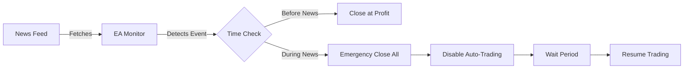

<div align="center">

# 💣 Forex News Killer EA

### *Your Trading Guardian During High-Impact News Events*


</div>

---

## 🎯 What Does It Do?

**Forex News Killer EA** is your automated bodyguard against market volatility during major economic announcements. When high-impact news hits (NFP, FOMC, CPI, etc.), this EA springs into action to protect your account by:

- ⚡ **Closing open positions** before news spikes
- 🚫 **Deleting pending orders** automatically  
- 🛑 **Disabling auto-trading** during events
- 📊 **Drawing visual markers** on your charts
- 💰 **Smart exit at break-even** when profitable

> *Think of it as a panic button that presses itself—perfectly timed.*

---

## 🚀 Quick Start

### Installation
1. Download `ForexNewsKillerEA.mq4`
2. Copy to `MT4/MQL4/Experts/` folder
3. Restart MetaTrader 4
4. Drag EA onto any chart

### ⚙️ Configuration
```
✓ Enable DLL imports in Tools → Options → Expert Advisors
✓ Add https://nfs.faireconomy.media/ to allowed URLs
✓ Customize your news filters in EA inputs
```

---

## ✨ Features That Matter

| Feature | Description |
|---------|-------------|
| 🎚️ **Impact Filter** | Choose High/Medium/Low impact news |
| 🔍 **Keyword Search** | Filter by event titles (NFP, GDP, etc.) |
| ⏰ **Smart Timing** | Set minutes before/after news to act |
| 📈 **Auto Updates** | Fetches latest news every 2 hours |
| 🎨 **Visual Lines** | See upcoming events on your chart |
| 💱 **Multi-Currency** | Works with USD, EUR, GBP, JPY, CAD, CHF |

---

## 📖 How It Works



---

## 🎨 Input Parameters

<details>
<summary>📰 News Settings</summary>

- **min_before**: Minutes before news to close trades (default: 5)
- **min_before_zero**: Minutes before to close at break-even (default: 60)
- **min_after**: Minutes to wait after news (default: 45)
- **include_high/medium/low**: Filter by impact level
- **title_phrase**: Comma-separated keywords to watch

</details>

<details>
<summary>⚡ Order Management</summary>

- **stop_algo**: Disable auto-trading during news
- **close_open**: Close all open positions
- **close_pending**: Delete pending orders
- **close_zero**: Exit at break-even if profitable
- **close_profit**: Minimum profit threshold ($)

</details>

<details>
<summary>🔔 Notifications</summary>

- **send_notif**: Push notifications to mobile
- **send_alert**: Pop-up alerts on desktop
- **delay**: Seconds between retry attempts

</details>

---

## 💡 Pro Tips

🎓 **Best Practices:**
- Run on a single chart per account (EA monitors all pairs)
- Test on demo first with high-impact news only
- Set `min_before_zero` to 60-120 minutes for early exits
- Use with other EAs—this won't interfere with their logic

⚠️ **Important Notes:**
- Requires internet connection for news feed
- Small delay possible during high-volume periods
- Always verify DLL and WebRequest permissions

---

## 🛠️ Tech Stack

- **Language**: MQL4 (MetaQuotes Language)
- **Platform**: MetaTrader 4
- **News Source**: [ForexFactory Calendar API](https://nfs.faireconomy.media/)
- **System Calls**: WinUser32.dll (for EA toggle)

---

## 📬 Connect & Contribute

<div align="center">

**Created by Ahmad (Ahmed-GoCode)**

[](https://github.com/Ahmed-GoCode)
[](https://github.com/Ahmed-GoCode)

*If this EA saved your trades, consider ⭐ starring the repo!*

</div>

---

<div align="center">


**Disclaimer**: Use at your own risk. Past performance doesn't guarantee future results.

---

> *"In quantum finance, as in quantum mechanics, the act of observation changes the outcome.  
> The wisest traders know when to collapse the wave function and when to stay out of the market entirely."*  
> — **Ahmad**

</div>
